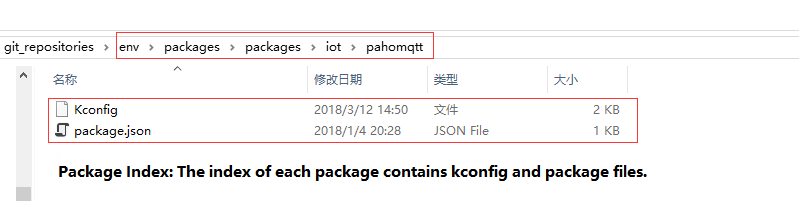
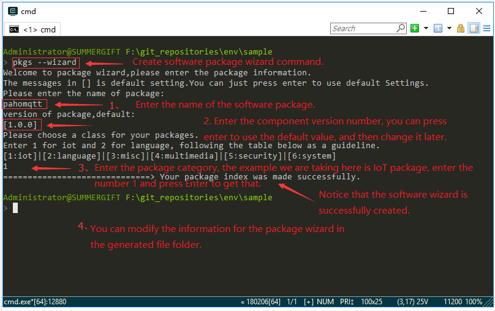
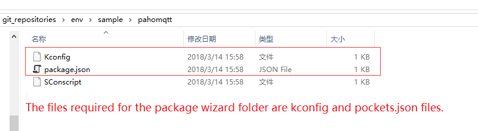
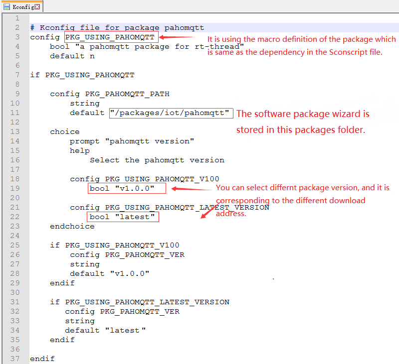
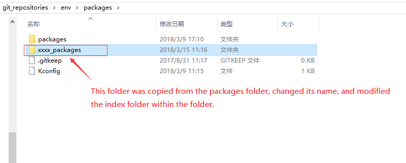
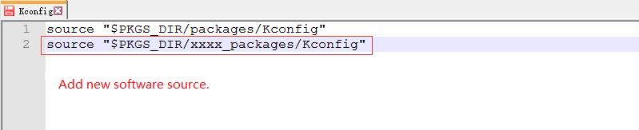
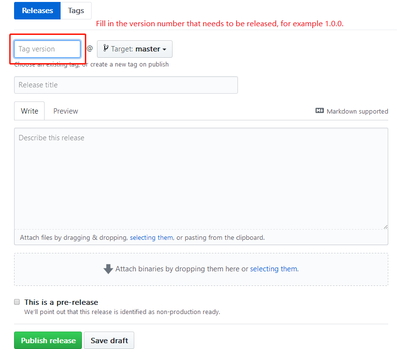

# How to Develop Software Packages?

[](https://travis-ci.org/RT-Thread/packages)[](https://github.com/RT-Thread/packages/pulls)

RT-Thread software packages run on the RT-Thread IoT operating system. Different categories of packages were created for different application areas, each of which consists of the description information, source code or library files.

Before making a software package, its functionality requires to be defined accurately, to ensure that it does not couple closely with the code that related to the product business logic, in order to improve the versatility of the package.

The package should contain:

- Source code and documentation.
- Package index.

For example, the hello software package contains:

- [package code and documentation](https://github.com/RT-Thread-packages/hello)
- [Package Index](https://github.com/RT-Thread/packages/tree/master/misc/hello)

# Organize Package code and Documentation.

Before making a package, you’ll need to read the [sample package documentation](https://github.com/RT-Thread-packages/hello) and check the folder structure of the sample package.

The software package and its documents should contain:

- The source files to implement the required function.
- The file `SConscript` in the root directory, which guides the compiler to build the software package.
- The sub-directory `example`, which contains code to demonstrate how to use the software package.
- The optional sub-module directories, controlled by `git`.
- The file `README.md` to describe the software package shortly.
- The sub-directory `docs`, which describes the details about the implementation.
- The optional sub-directory `port`, which contains the code required by the software package to run on various platforms.

# Create package index.

Package index: the package description files that are stored under the `env\packages` folder. Take the `env\packages\packages\iot\pahomqtt` folder as an example, it contains:



- Kconfig: storing the configuration items, such as package versions, feature options, etc.
- package.json: storing information such as the name of the package, package introduction, download links for each version, etc.

## Use Index to Generate Wizard

We can make package index files by using Env’s package index generation wizard feature. Type the command`pkgs --wizard`, shown as follows:



The generated contents are shown as follows:




Note that the `SConscript` file is only used when packing the source code by moving it to the package source folder. It doesn’t have to exist in the index folder after the packing process.

## Revise package.json File

- **package.json file** Introduction:

```
{
    "name" : "pahomqtt",
    "description" : "a pahomqtt package for rt-thread",   # Package Description Info
    "keywords" : [
        "pahomqtt"
    ],
    "site" : [
    {
       "version" : "v1.0.0", 
       "URL" : "https://pahomqtt-1.0.0.zip",              # Modify the download address of the compressed package based on its version number.
       "filename" : "pahomqtt-1.0.0.zip",
       "VER_SHA" : "fill in the git version SHA value"    # The compressed package form does not need to be filled in.
    },
    {
       "version" : "latest",                              # latest verison
       "URL" : "https://xxxxx.git",                       # Fill in the Git address
       "filename" : "Null for git package",
       "VER_SHA" : "fill in latest version branch name,such as mater" # Fill in SHA or the branch name.
    }
    ]
}
```

There are two types of ‘URL’ values in a file that can be filled in for each version:

- **Git**: the Git repository address and the corresponding version of **SHA**. Generally, the **SHA** is set to `master` for RT-Thread `latest` version.
- **Compressed package**: the download address of the specific package and **SHA** doesn’t have to be filled at this time.

**Package.json** is a description file for the software package, which contains the package name, package description, author, and the required download link for source code. Note, a description of the applied license must be included, such as GPLv2, LGPLv 2.1, MIT, Apache license v2.0, BSD, etc.

The modified package.json is as follows:

```
{
    "name" : "pahomqtt",
    "description" : "Eclipse Paho MQTT C/C++ client for Embedded platforms", # Update the description info.
    "keywords" : [
        "pahomqtt"
    ],
    "site" : [
    {
       "version" : "v1.0.0",                                             # v1.0.0
       "URL" : "https://github.com/RT-Thread-packages/paho-mqtt.git",    # update git address
       "filename" : "paho-mqtt-1.0.0.zip",
       "VER_SHA" : "cff7e82e3a7b33e100106d34d1d6c82e7862e6ab"            # Enter the specified SHA value.
    },
    {
       "version" : "latest",                                             # latest version
       "URL" : "https://github.com/RT-Thread-packages/paho-mqtt.git", 
       "filename" : "paho-mqtt.zip",
       "VER_SHA" : "master"                                              # Enter master 
    }
    ]
}
```

## Modify Kconfig File:

The content of **Kconfig** is as follows:



The Kconfig files in the package index are primarily used by the menuconfig command, and some of the options for the package must be defined, here are notes that you need to pay attention to:

1. Most **Kconfig** contents automatically generated are necessary. The value of the options could be modified, but must not be deleted.
2. The package must contain a configuration item beginning with the prefix `PKG_USING_`, so that RT-Thread's package manager can correctly identify it. Assuming that the name of the package is SOFTA, the corresponding package option should be `PKG_USING_SOFTA` ;
3. The other options related to this SOTA package need to be defined with a configuration item beginning with `SOFTA_`, which can be `SOFTA_USING_A` or `SOFTA_ENABLE_A`.
4. Packages that support the RT-Thread **latest** version require at least one fixed version, to prevent the appropriate version from being missed at some point.
5. If the package needs more configuration items, you can refer to the **Kconfig** files from other existing packages for suggestions.

## Upload Software Package

Packages could be uploaded to git or other downloadable sites. It’s recommended to save them as git repositories, which is convenient to update software packages.

Reference: [RT-Thread Package Repository](https://github.com/RT-Thread-packages)

## Test Software Package

- **Download the package:** Copy the package index to `env\packages\packages`, and then download the package online in [RT-Thread Env](https://www.rt-thread.io/download.html?download=Env), test if it is successfully downloaded.
- **Test the package functions:** After downloading, execute the command `scons` to recompile the project, run it in the appropriate environment, and check if the package function works correctly.
- **Switch the package version:** Try to switch the version of the package under menuconfig, to check if the version switching feature is working.

## Submit Software Package Index

Finally, the package index files need to be pushed through the PR process to the RT-Thread package repository: https://github.com/RT-Thread/packages.

Click [Here](https://www.rt-thread.org/document/site/development-guide/github/) to learn how to submit a PR.

# Manage Software Package Index Source

Env can download packages from multiple package sources, and the list of packages for each source is stored in `env\packages` folder. For example, the RT-Thread official package list is stored under the `env\packages\packages` folder.

## Add Software Package Source

- Duplicate the official RT-Thread package folder, change the folder name and delete the unnecessary package index files within the folder, then add the necessary ones.



- Update the Kconfig files under the `env\packages` folder and add package source information to the Kconfig file.



## Delete Software Package Source

- Delete the software source folder;
- Delete the corresponding source folder information in the Kconfig file.

# New Release Process

The following procedures are required before the release of a new version of the package:

1. Check the package to make sure that the package function works properly.
2. Use the Github Release feature to publish a new version, if you don’t have the permission to notify the administrator to release a new version for you. Refer to the [paho-mqtt package repository](https://github.com/RT-Thread-packages/paho-mqtt/releases) for how to release a new version.



3. Modify the local package index files, add information of the new information in the Kconfig file and package.json.

4. Test the download and deletion features for this new version locally, as well as the installation to ensure that the package can be added to the project successfully.

5. Submit a PR for the Package Index (https://github.com/RT-Thread/packages) and notify the administrator to merge it.
